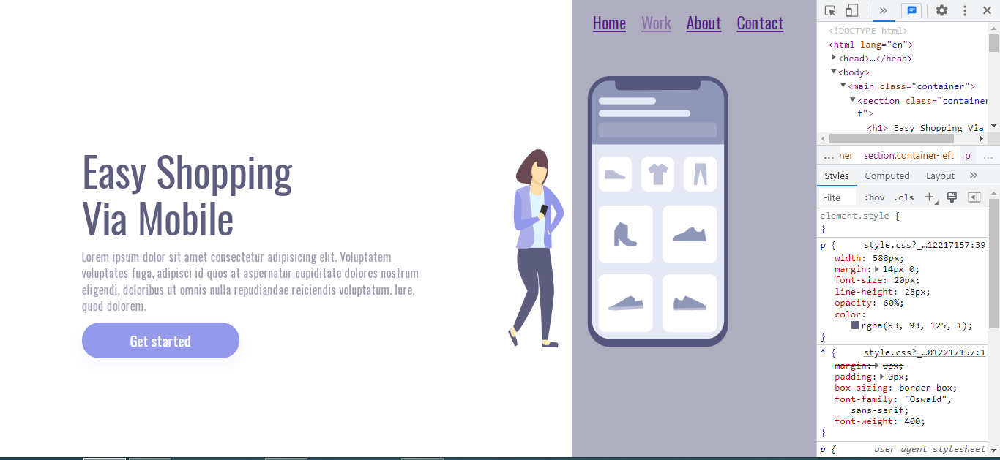
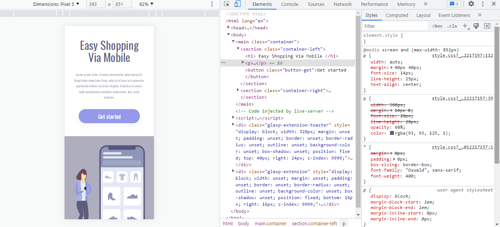

<h1 align="center"># 🌐 Projeto 04 — EASY SHOPPING</h1>

> <p align="center">⚙️ Projeto desenvolvido para praticar a estruturação com **HTML semântico**, aplicação proridade de **CSS como o POSITION, PSEUDO ELEMENTOS/CLASSES, e tornar a página **responsiva para diferentes dispositivos (portrait) **.</p>

---

## 🚀 📊  Linguagens usadas


| Linguagem | Porcentagem estimada |
|----------|----------------------|
| 📄 HTML  | 18%                  |
| 🎨 CSS   | 82%                  |

---

## 🎯 Funcionalidades

- ✅ HTML com estrutura semântica
- ✅ Estilização com as propriedades position e pseudo elemento/classe
- ✅ Responsividade (mobile (portrait) e desktop)
- ✅ Fixação de seção
- ✅ Efeitos visuais com hover

---

## 🧠 Aprendizados

Durante o desenvolvimento, aprendi:

- 🗂️ A importância do HTML semântico para acessibilidade e organização  
- 🖌️ Como aplicar efeitos de hover com CSS  
- 📱 Como tornar um layout adaptável a diversos tamanhos de tela (portrait)  
- 🔧 Fixação de elementos na tela com CSS  
- 🎯 Leitura e interpretação de um layout no Figma para codificação

---

## 🧠 Visualização do projeto:
 
- 💻 Versão desktop:



- 📱 Versão dispositivos móveis (portrait):



---

## ▶️ Como executar localmente

1. Clone o repositório:
```bash
git clone https://github.com/Danielferrazdev/projeto-04-easy-shopping.git